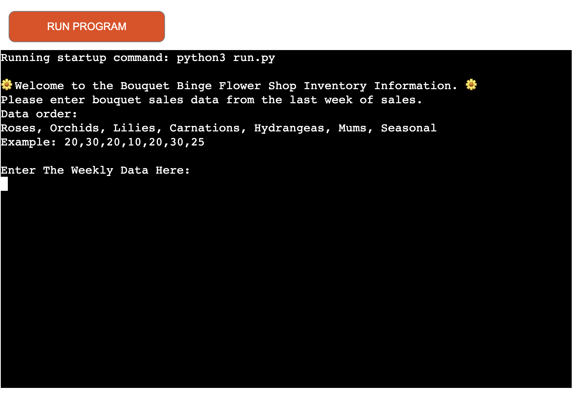
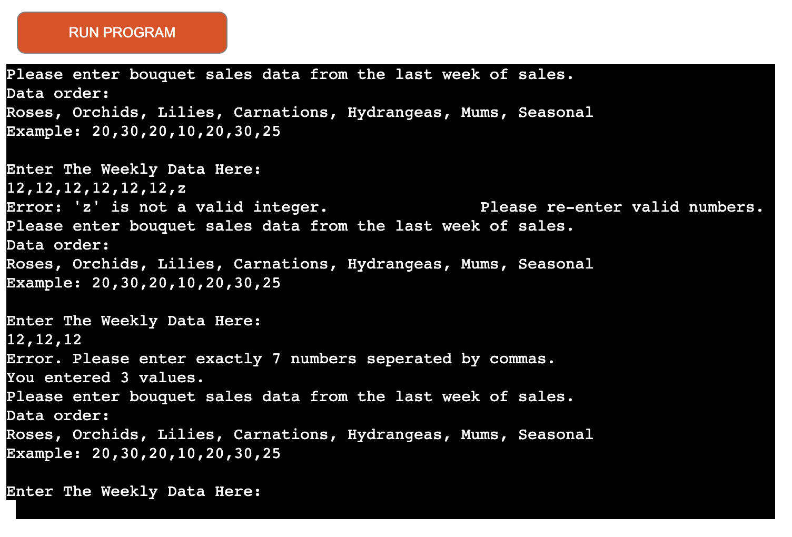
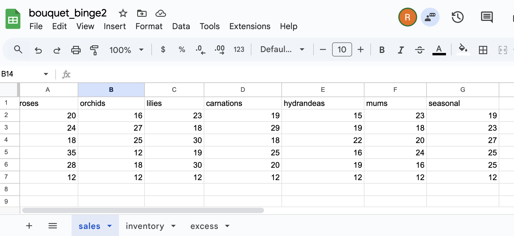
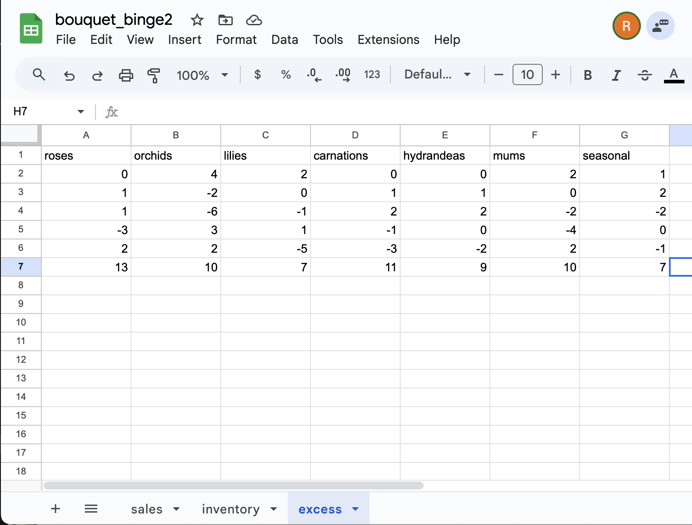
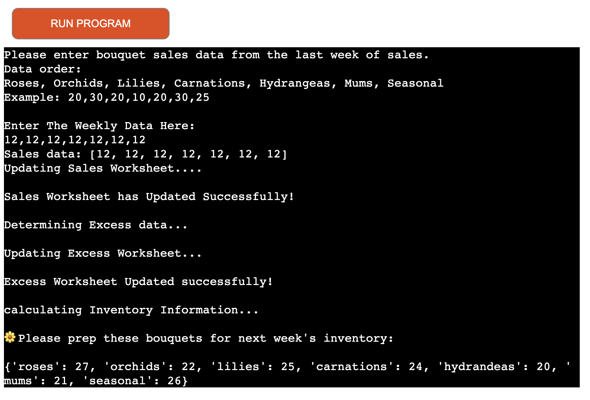
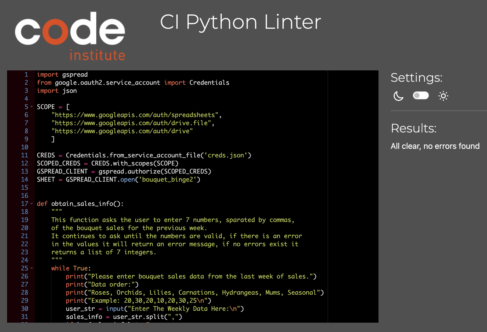

# Bouquet Binge Flower Shop

This is a project which was very much inspired by the Love Sandwiches project. It is designed to function in command line based Python to calculate the weekly sales inputs from a non-existent flower shop called Bouquet Binge. Upon the start of the program, the user is prompted to input 7 values for the latest variety of bouquet sales data from the flower shop. The program then calculates any excesses or shortages in inventory and produces recommendations for the number of bouquet inventory required for the following week based on a recommended 15% inventory surplus as a buffer for projected sales.

This program utilizes google sheets to store the inventory, sales and excess data information for the Bouquet Binge Flower Shop.

[View the live project here.](https://bouquet-binge-2-7f60670f0309.herokuapp.com/)

## Features

- Once the program is run the user is prompted to input 7 numbers representing sales values for the 7 different types of bouquets that are sold: Roses, Orchids, Lilies, Carnations, Hydrangeas, Mums, and Seasonal.

- The program then checks the user input for any invalid inputs, such as non integer inputs or missing numbers and will give error messages to the user and request the user to input the 7 numbers again.

- This program uses the gspread API to interact with Google Sheets where the data is stored in all of the respective worksheets “inventory”, “excess” and “sales” for the data given, calculated and updated for all of the different types of flower bouquets sold.

[Google worksheets for inventory](https://docs.google.com/spreadsheets/d/1Rcb7uvgCEq8Ns7ZwGlAph3yQg5Dwz02bqxLMq091CFE/edit?gid=59501002#gid=59501002)

[Google worksheets for sales](https://docs.google.com/spreadsheets/d/1Rcb7uvgCEq8Ns7ZwGlAph3yQg5Dwz02bqxLMq091CFE/edit?gid=0#gid=0)

[Google worksheets for excess](https://docs.google.com/spreadsheets/d/1Rcb7uvgCEq8Ns7ZwGlAph3yQg5Dwz02bqxLMq091CFE/edit?gid=884698397#gid=884698397)

- Once the input is valid, the program will update the sales information given in the Google Sheets “sales” worksheet.

- It will also calculate the excess or shortage of each type of bouquet based on the sales numbers given and the current listed inventory in the “inventory” worksheet.

- The “excess” worksheet will then also be updated with either an excess, results of a positive number, or a shortage, results of a negative number, for each type of bouquet.

- The “inventory” worksheet will also be updated in Google Sheets. *See Remaining Bugs

- The program then calculates the average weekly sales over 5 weeks and recommends the required inventory, adding on an additional 15% inventory surplus to allow for additional quick, last minute sales.

## Possible Future Features

- Include actual sales numbers for each type of bouquet to then also calculate profits and losses

- Include options for items to be sold at a discount of a certain percentage to mitigate losses the last two days of the week.

- Add a feature to generate weekly or monthly sales reports to track sales trends over time to show which bouquet types are in high demand and during which periods of time.

## Technologies Used

- Python 
- [PEP8:](https://pep8ci.herokuapp.com/#) To check code for PEP8 requirements.
- [Pages:](https://apps.apple.com/us/app/pages/id361309726) for grammer and spell check
- [GitHub:](https://github.com/) Used to store the project code.
- [VSCode](https://code.visualstudio.com/) Used for version control.
- [Heroku:](https://www.heroku.com/?utm_source=google&utm_medium=paid_search&utm_campaign=amer_heraw&utm_content=general-branded-search-rsa&utm_term=heroku&utm_source_platform=GoogleAds&gad_source=1&gclid=Cj0KCQjwna6_BhCbARIsALId2Z2wHGJGgLVyKPEGQTXuZQLrVZQNEd3Cax-bKm8JRkfbp4zbmawAdZUaAp3-EALw_wcB) Used to deploy the application.

## Testing

- Some issues found when run through PEP8 CI Python linter, mostly missing or too many spaces and a few lines that contained too many characters. All was corrected.

## Solved Bugs

- Had a problem with the try/except validation line of the code within the obtain_sales_info function and had an error message. It was corrected by adding in a break after the except message to print out the correct error message and validate the users input correctly.

## Remaining Bugs

- The inventory worksheet is not updating properly, but I ran out of time to fix this last minute bug, as it had been updating previously when checked, but I had changed some code and it seems to no longer update. 

## Deployment

This webisite is deployed to Heroku. 

The steps to deploy are as follows:

1. Log in to Heroku.
2. Click on "Create New App" on the top right on the "new" button.
3. Choose a unique app name and add your region.
4. Click on "Create app".
5. Navigate to the "settings" tab.
6. Click on "Reveal Config Vars".
7. Add Config Var called "CREDS" and paste the CREDS.JSON file into the value field.
8. Add Config Var - key is PORT and the value is 8000.
9. Scroll down the page to "Buildpacks".
10. Click on "Add Buildpacks".
11. First add "python", then click save.
12. Secondly, add "nodejs" and click save. These buildpacks must be in this order and can be clicked on and dragged in place, if not in order.
13. In the Deploy tab at the top, select GitHub and fill in by searching for the GitHub repository name and then choose either the automatic deployment option or the manual deployment option for your app.

If automatic deployment is chosen, the program will automatically update with each new push to the respository.

This respository can be cloned by entering the command "git clone https://github.com/rachank/bouquet_binge2.git" into the terminal of your IDE.

The link for this website on GitHub is here: https://github.com/rachank/bouquet_binge2.git

## Credits

 - Thank you to my mentor Brian Mancharia for code review, tips, help and feedback. All so very much appreciated! 
 - Code Institute for the deployment terminal for Heroku.
 - [w3schools:](https://www.w3schools.com/python/default.asp) was used for various references.
 - [Emoji Unicode Tables:](https://apps.timwhitlock.info/emoji/tables/unicode) was used to add the flower emoji unicodes.
 - This project was very much insired by the Love Sandwiches project and contains some similarities in the code. 
